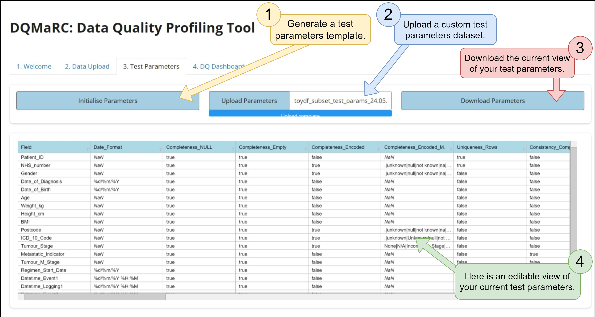
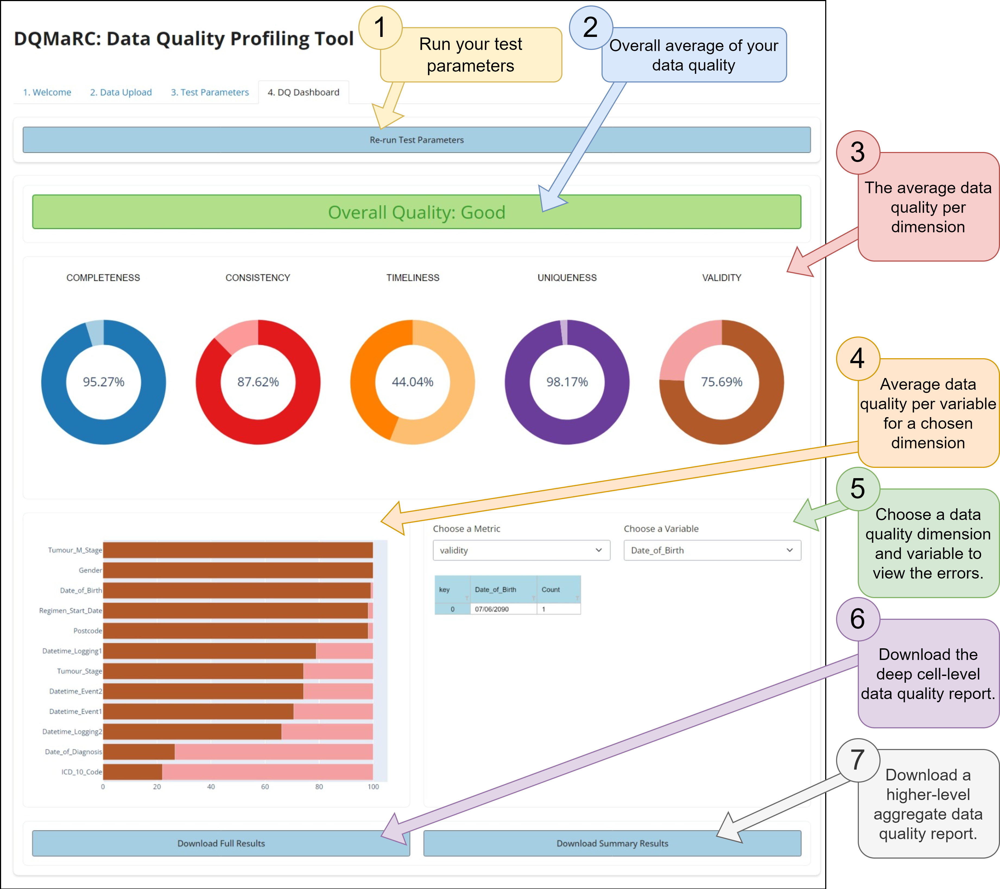

.. _Frontend_Tutorial:

============================
Frontend ShinyPy Tutorial
============================

We built a frontend user interface to give non-python users easy access to :ref:`DQMaRC <api.DQMaRC>` for data quality profiling. 
This frontend was built using `shiny for python` `pandas <https://pandas.pydata.org/docs/index.html>`_ and is accessible freely by following this link: `DQMaRC Shiny Front End <https://placeholder.link>`_.

We explain how to use this frontend user interface in three simple steps:

1. Upload a chosen csv/xlsx input dataset for data quality profiling.
2. Initialise or upload test parameters specifying which metrics should run for the given dataset.
3. Run the test parameters and gain a quick overview of your data quality report. 

Below illustrate these steps using screenshots and explain key functional items using number encodings.

Welcome Page
------------
Figure 1 below shows the welcome page. Here you will find an overview of key features 
and the overall workflow to use :ref:`DQMaRC <api.DQMaRC>`. 

.. figure:: ../images/shiny1.png
  :alt: A screenshot image showing the welcome page to the user interface for DQMaRC.
  :scale: 10%

  Figure 1: A screenshot image showing the welcome page to the user interface for DQMaRC.

Data Upload
------------
1. This is where you upload your input dataset. It must be either csv or xlsx format with only a single spreadsheet.
2. Once your dataset is uploaded, this tab shows you the number of rows and columns of your input dataset.
3. This panel lets you view your input dataset. Note that you can scroll vertically and/or horizontally depending on the size of your dataset.

.. figure:: ../images/shiny2.png
  :alt: A screenshot image showing the data upload page of the DQMaRC frontend user interface.
  :scale: 18%

  Figure 2: A screenshot image showing the data upload page of the DQMaRC frontend user interface.

Test Parameters
----------------
1. This is where you initialise your test parameters template. This is especially useful if this is your first time using :ref:`DQMaRC <api.DQMaRC>`. 
2. You can upload your test parameters as a csv if they were previously predefined. This is especially useful if over time you need to modify your test parameters and would like to reuse the template for repeated DQ profiling.
3. You can download your test parameters as they appear below, even after edits are made. It is recommended that you keep a local copy of your test parameters for reviewing, editing, or audit purposes.
4. Here you can view and/or edit your test parameters. This is useful for quick changes without needing to download and re-upload an amended csv version. However, we do recommend that you edit your test parameters offline in MS Excel for ease of use.

  Figure 3: A screenshot image showing the DQMaRC frontend window to initialise, edit, upload, or download the test parameters needed to run the data quality profiling.

DQ Results
-----------
1. Here you run :ref:`DQMaRC <api.DQMaRC>` using the test parameters specified previously. Once you click **"Run Test Parameters"**, it will change to **"Re-run Test Parameters"**, allowing you to go back to change the test parameters, and re-run them if needed.
2. This is the overall average of all fields and metrics.
3. These are the averages of all metrics per data quality dimension.
4. These are the data quality percentages for all variables that were measured for a chosen metric.
5. Here you can choose a data quality metric and a variable to view a frequency count of the erroneous data.
6. Download the full data quality report here. This is a dataset that concatenates your source input data with the comprehensive, cell-level data quality flags.
7. Download a high-level summary of the data quality dimensions per input data field.

  Figure 4: A screenshot image showing the data quality results dashboard when DQMaRC is run. 

